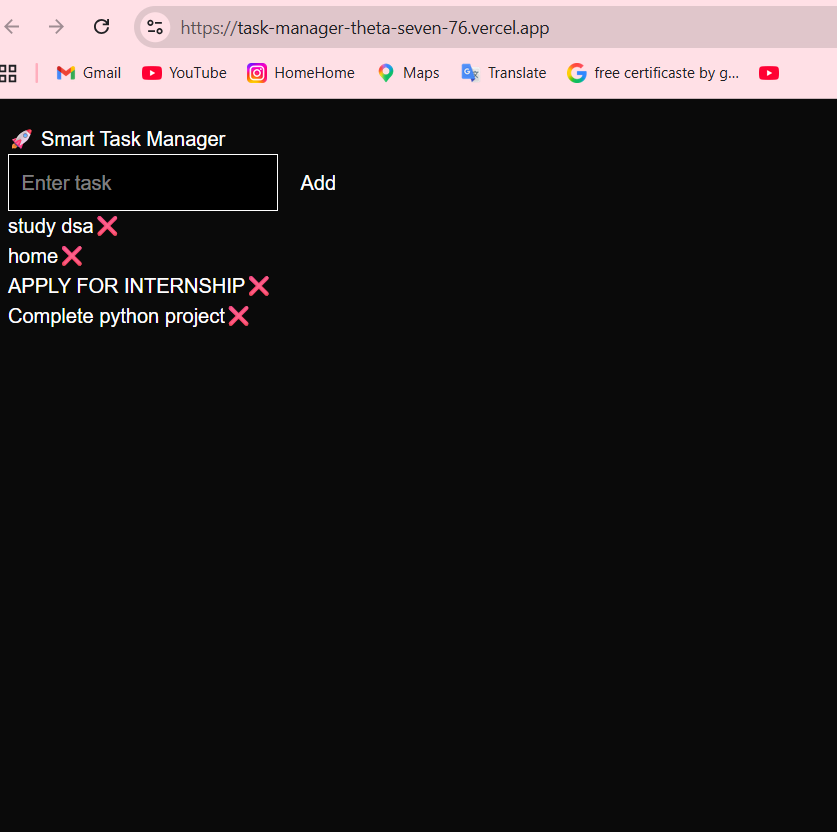

# Smart Task Manager

## Overview

Smart Task Manager is a full-stack task management application built using Next.js and TypeScript.

The application allows users to manage daily tasks with a clean and responsive interface.

---

## Features

- Add tasks
- Delete tasks
- Responsive UI
- Full-stack structure
- Clean task management system

---

## Tech Stack

- Next.js
- React
- TypeScript
- CSS

---

## Project Structure

```bash
frontend/
backend/
```

---

## Run Locally

```bash
git clone https://github.com/siyapriya14/task-manager.git

cd task-manager

npm install

npm run dev
```

---

## Live Demo

[Click Here to Use the App](https://task-manager-theta-seven-76.vercel.app)

---

## Screenshots

()

---

## Future Improvements

- Task editing
- Authentication system
- Task categories
- Dark/Light mode
- Database integration
